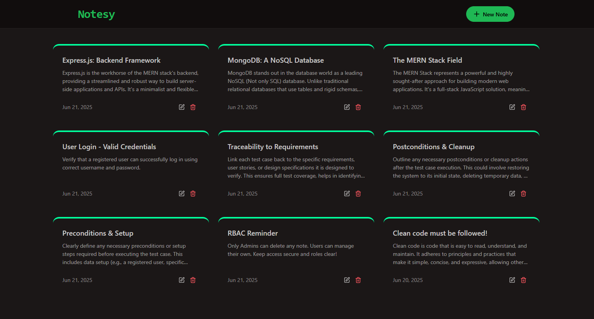
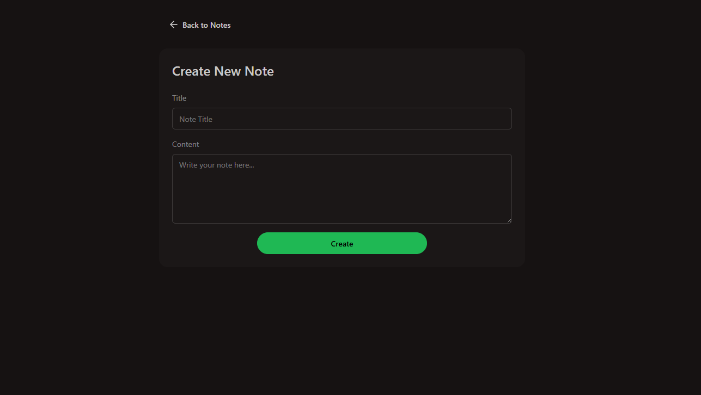
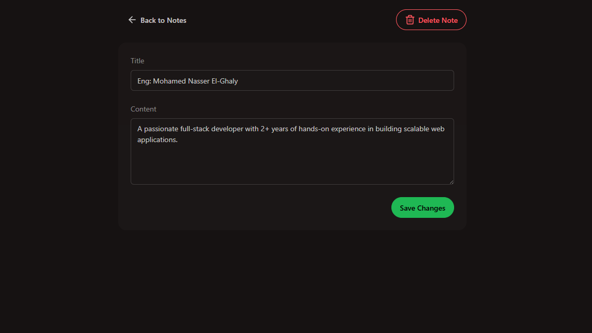

# 📝 Notesy - MERN Notes App

**Notesy** is a minimalist full-stack notes application built with the **MERN stack** (MongoDB, Express, React, Node.js). It allows users to create, read, update, and delete notes through a clean and responsive interface.

---

### 🏠 Home Page  

### ✍️ Create Note  

### ✍️ Update Note  

---

## 🚀 Features

- 📓 Full **CRUD** operations for notes
- 🔁 Fully tested **RESTful API** via **Postman**
- 🎨 Beautiful and responsive UI using **TailwindCSS** and **DaisyUI**
- ⚡ Fast React app bootstrapped with **Vite**
- 🧠 Clean, scalable codebase with modular folder structure
- 🌐 Deployed frontend and backend separately on **Vercel** and **Railway**

---

## 🧰 Tech Stack

### 🔷 Frontend
- React (Vite)
- TailwindCSS
- DaisyUI (Tailwind component library)
- Axios
- React Router DOM

### 🔶 Backend
- Node.js
- Express.js
- MongoDB (Mongoose)

### 🛠 Tools
- Postman (API testing)
- Railway (Backend hosting)
- Vercel (Frontend hosting)
- Git & GitHub
